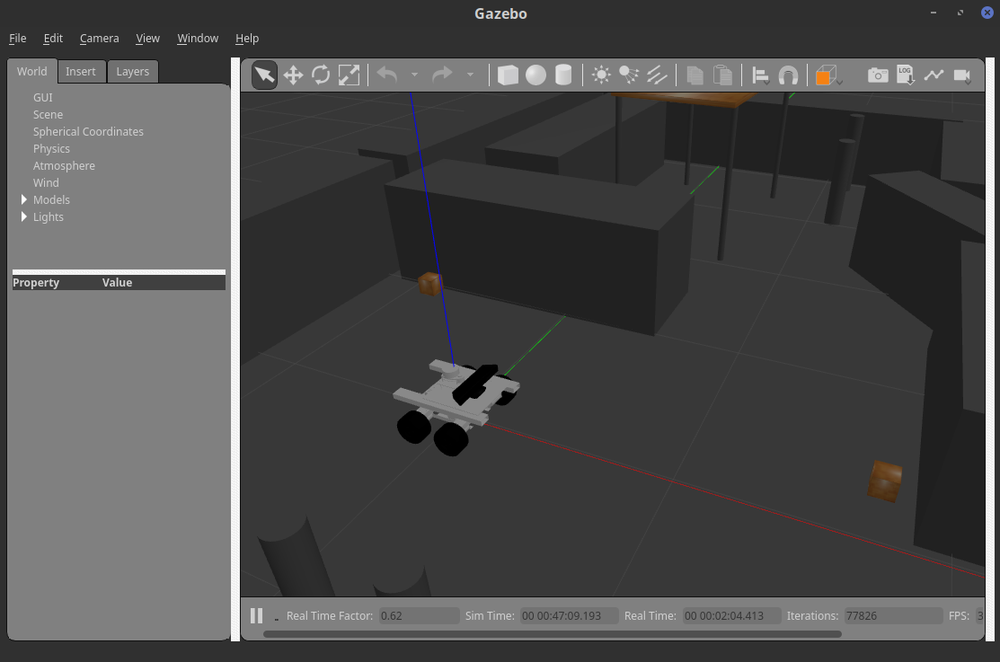
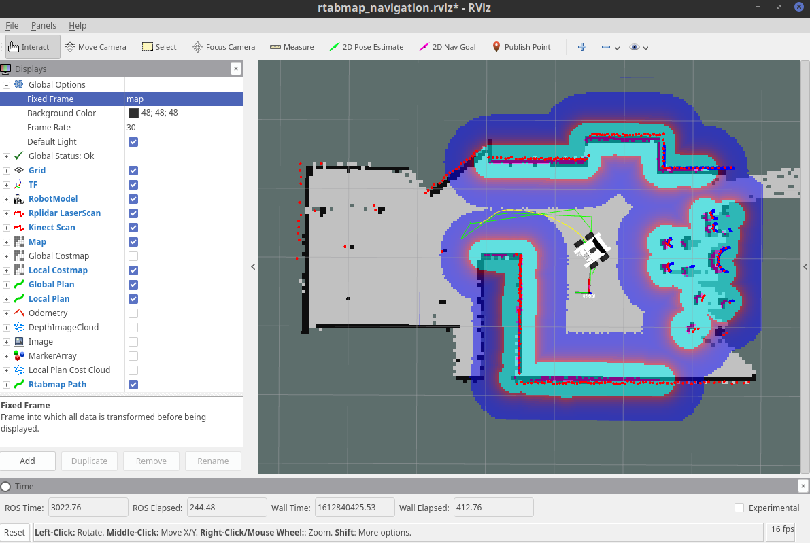

# Getting Started
Here you will find the instructions to test the VVA Autonomous Mobile Robot, either in simulation or with a hardware vehicle.

## Installation

### Pre-requisites
> NOTE: These steps were tested on Linux Mint 19.1 which is based on Ubuntu 18.04 (Bionic). For the hardware vehicle, was tested with an Nvidia Jetson Nano runnng the official Nvidia image of Ubuntu Bionic 18.04.

* **Install ROS Melodic**

  > NOTE: It should also work in ROS Noetic but it has not been tested yet.

  Follow the instructions from the page [Ubuntu install of ROS Melodic](http://wiki.ros.org/melodic/Installation/Ubuntu)

* **Install DeepSpeech v0.8.2** for TensorFlow-Lite (If installing on the J-Nano use python3.7).
  ```bash
  python3 -m pip install deepspeech-tflite
  ````
* **Download rosjava minimal (Optional)**: If you want to make a modification of the request or the response of the ROS Service used in the Mobile App, then rosjava is needed to generate the .jar file. [Get rosjava_minimal](http://wiki.ros.org/rosjava/Tutorials/kinetic/Source%20Installation)

### VVA Installation
* Clone the repository
  ```bash
  git clone https://github.com/AndresA007/AutonomousMobileRobot.git
  ```
* The package depth_nav_tools/laserscan_kinect is used for cliff detection, it is not available in ROS Melodic but it can be downloaded and compiled. [Get depth_nav_tools
](https://github.com/mdrwiega/depth_nav_tools)
  ```bash
  cd AutonomousMobileRobot/VVA_ws/src/
  git clone https://github.com/mdrwiega/depth_nav_tools.git
  ```
* Download the DeepSpeech model files “deepspeech-0.8.2-models.scorer” and “deepspeech-0.8.2-models.tflite” from [the Web site of DeepSpeech](https://github.com/mozilla/DeepSpeech/releases/tag/v0.8.2), save them in “AutonomousMobileRobot/DeepSpeechModule/english_model_v0.8.2/”
* Compile the ROS nodes
  ```bash
  cd AutonomousMobileRobot/VVA_ws/
  catkin_make
  ```
  If there are errors regarding packages not found install them from apt
  ```bash
  sudo apt install ros-melodic-PACKAGE_NAME
  ```
  In my case these additional packages were required
  ```bash
  sudo apt install ros-melodic-image-geometry
  sudo apt install ros-melodic-pcl-ros
  sudo apt install ros-melodic-costmap-2d
  sudo apt install libusb-1.0-0-dev
  ```
* Add the following lines at the end of ~/.bashrc. Replace the IP addresses as per your network or use "127.0.0.1".
  ```bash
  # ROS Environment
  export AUTONOMOUS_MOBILE_ROBOT_HOME=~/AutonomousMobileRobot
  source /opt/ros/melodic/setup.bash
  source $AUTONOMOUS_MOBILE_ROBOT_HOME/VVA_ws/devel/setup.bash
  export ROS_IP=(LOCAL IP ADDRESS)
  export ROS_MASTER_URI=http://(MASTER IP ADDRESS, IN THIS CASE IS ALSO THE LOCAL ADDRESS):11311
  ```
  Reload the .bashrc
  ```bash
  source ~/.bashrc
  ```

## Run in simulation
Open one terminal per each command.
* Deploy the model in Gazebo:
  ```bash
  roslaunch vva_gazebo vva_world.launch
  ```
* Start rviz and the state_publishers:
  ```bash
  roslaunch vva_description rviz_rtabmap_simulation.launch
  ```
#### For building the map:
* Start rtabmap:
  ```bash
  roslaunch vva_navigation vva_rtabmap_simulation.launch localization:=false
  ```
* Use the teleop:
  ```bash
  roslaunch vva_nav_test vva_teleop3.launch
  ```
* Move the robot to generate the map, turn 360° in different places. If you want to restart the map execute:
  ```bash
  rosservice call /rtabmap_jnano/reset
  ```
#### For navigating (Localization mode):
* Start rtabmap:
  ```bash
  roslaunch vva_navigation vva_rtabmap_simulation.launch localization:=true
  ```
* Start the modules: navigation (move_base), image-camera_info sync, laserscan_kinect, laserscan_kinect_filter and vva_navigation_correction:
  ```bash
  roslaunch vva_navigation vva_consolidated_nav.launch simulation:=true
  ```
* Update the location coordinates in navigation_intent_params_simulation.yaml and start the navigation-intent node:
  ```bash
  roslaunch vva_user_intents vva_user_intents.launch simulation:=true
  ```
* Start the DeepSpeech module:
  ```bash
  $AUTONOMOUS_MOBILE_ROBOT_HOME/DeepSpeechModule/run_DS_module_laptop.sh
  ```
* Start the Voice Interaction Speech Recognition module:
  ```bash
  roslaunch vva_voice_interact_server vva_voice_interact_server.launch
  ```

  Simulation running on Gazebo

  

  Simulation as seen from Rviz

  


## Run on the hardware (Jetson Nano)

_**TODO!**_

## Known Issues
* The model is not shown in Gazebo, when the joints are of type "revolute". For example, this happened with the joints between the Kinect and the base.
* vva_cliff_detector doesn't work when simulated in Gazebo, it shows the error: "Could not perform stairs detection: Depth image has unsupported encoding: 32FC1"
* Sometimes the depth image transmission has interruptions or it just doesn't arrive any more, hence the navigation stack stops working. The cause of this issue is unknown so far, maybe it is due to the weakness of the WiFi signal in some locations.
* The package "vva_voice_interact_client" (previously called "vva_voice_interact_rbpi") didn't work on the J-Nano because the wake-word detection program, Porcupine, didn't have a compatible version for arm64 architecture.
* When voice commands are captured using the microphones array of the Kinect, the Speech Recognition doesn't work accurately. Maybe due to the environmental noise and because the microphones are far from the person speaking.
* When running on the J-Nano, the depth image of the Kinect doesn't work properly when the argument “depth_registration” is set to "true" when using the package "openni_launch". This didn't happen on the Raspberry Pi (rbpi). This was avoided using other available topics.
* The odometry based on Lidar (vva_lidar_odom) gets lost when the vehicle follows a curved trajectory (translation + rotation).

## List of folders included in this repository
* **Android** - Contains the Android Studio project (VVA_Mobile_Client) of the Mobile App and a rosjava workspace (vva_rosjava_ws) to generate the necessary .jar files to allow the Mobile App to communicate with the ROS service.
* **Arduino** - Contains the source code to be used in the microcontroller Arduino Mega2560, in charge of all the low level hardware control.
* **DeepSpeechModule** - Contains the DeepSpeech TensorFlow model files, the Python source code and bash scripts to run the Automatic Speech Recognition.
* **Rtabmap_SavedMaps** - Saved RTABMap .db files (maps) from different locations on different light conditions.
* **RunAsBackgroundScript** - Contains a bash script to start all the modules in background.
* **VVA_ws** – ROS workspace with the source code files.

## Included ROS packages
* **vva_base_controller** - Control of the wheels and communication with the Arduino Mega2560.
* **vva_cliff_detector** - This module is a fork of the code of depth_nav_tools to slightly change the behavior regarding the topics. It is in charge of detecting holes or cliffs.
* **vva_cliff_detector_layer** - Fork of the code of depth_nav_tools to reduce the verbosty of the module. It is in charge of including the holes and cliffs in the costmap.
* **vva_description** - Contains the URDF model and the launch files for rviz.
* **vva_gazebo** - Gazebo worlds.
* **vva_jnano_consolidated** - Consolidated launch file that starts in the J-Nano: Base controller, OpenNI Kinect, kinect_aux, RP-Lidar, state publisher.
* **vva_kinect_aux** - In charge of changing the tilt of the Kinect and of publishing the position of the joints according with the Kinect's IMU.
* **vva_lidar_filter** - LaserScans filter used to reduce the angle covered by the laserscan_kinect and hence remove the noise generated by the Kinect in a small section of the field of view.
* **vva_lidar_odom** - LaserScan based odometry, uses the icp_odometry module of rtabmap.
* **vva_msgs** - Package that contains the definitions of the customized messages and services used in VVA.
* **vva_navigation** - Contains the modules related to the mapping, localization and navigation stack, including rtabmap and move_base.
* **vva_nav_test** - Manual control of the robot based on the keyboard arrow keys and also by scripting. It also contains a node to generate customized statistics in tables based on selected topics.
* **vva_robot_healthcheck** - Receives services and topics with reports of the health of the system and provides feedback to the user using the Kinect's LED or any other available means.
* **vva_rplidar_ros** - Fork of the rplidar_ros package. It is modified to add options that enable the change of the values of the Lidar intensities.
* **vva_topics_sync** - Package that uses message_filters to synchronize the image_raw and camera_info topics generated by the Kinect. Useful when the Kinect is in a remote node.
* **vva_user_intents** - This package contains nodes in charge of the execution of actions identified during the Intent Recognition. Besides, is responsible for the high level behaviors of the robot.
* **vva_voice_interact_client** - This node is in charge of interfacing with the microphones array of the Kinect and perform the wake-word detection, which is based on Porcupine. This package is not compatible with J-Nano, see the "Known issues" section.
* **vva_voice_interact_server** - This package receives an audio clip through a ROS service and invokes the DeepSpeech module to perform the Automatic Speech Recognition. It also performs the mapping between audio transcripts and intent services.
