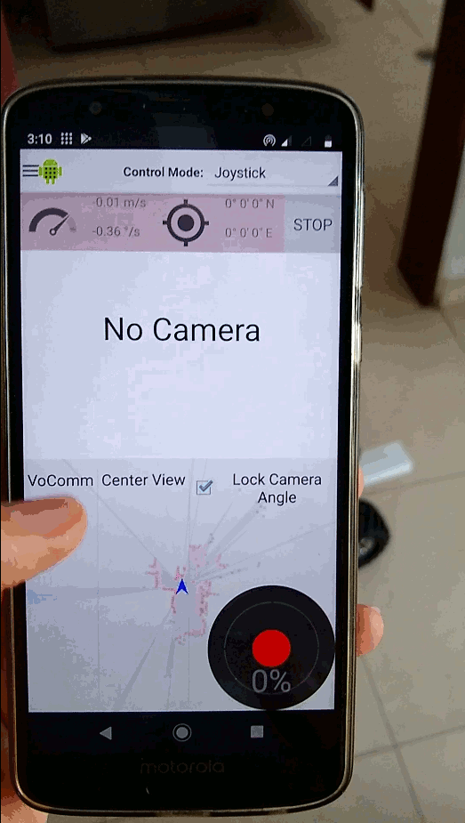

# AutonomousMobileRobot
A differential drive Autonomous Mobile Robot based on the navigation stack of ROS1. Supports offline Automatic Speech Recognition using Mozilla’s DeepSpeech.

## Short Description

## Images

